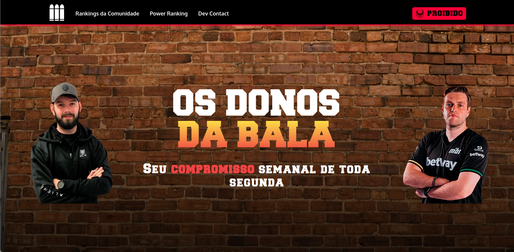

# Os Donos da Bala
 
## Tech Stack
### Frontend
   - NextJS
   - Tailwind
   - Daisyui
   - Framer Motion
   - Typescript
### Backend
   - MongoDB
   - Postgresql
   - Graphql
   - Strapi
   - Next-Auth with Cognito OAuth2
### Deployment
   - Backend on Heroku
   - Frontend on Vercel

## Installation
For a full experience of Donos da Bala some enviroment variables is required that you can see on .env.example file.

